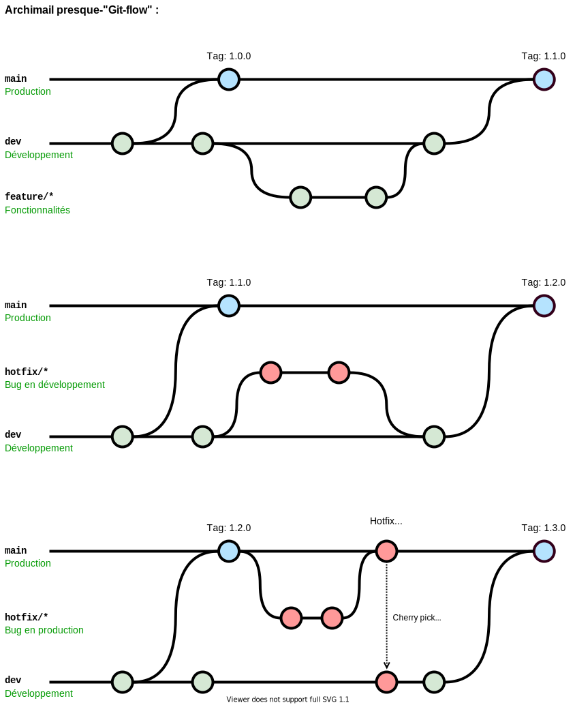
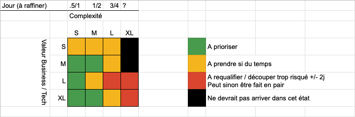

# Contribuer au projet

Archimail est un projet open-source auquel vous pouvez contribuer. Vous retrouverez ci-après les différentes règles et nomenclatures suivies dans ce dépôt.

## Git
### Branches et flux Git
Le projet respecte une version allégée de "[GitFlow](https://danielkummer.github.io/git-flow-cheatsheet/index.fr_FR.html)".

- 🧑‍💻 La branche de développement est `dev`
  - Cette branche est définie comme par défaut dans github
  - Cette branche est protégée contre les commits venants d'utilisateurs non administrateurs
- 🏷️ La branche de production en cours est `main`
  - Cette branche est protégée contre les commits venants d'utilisateurs non administrateurs
- ✨ Les branches de fonctionnalités doivent commencer par le préfixe `feature/` ou `feat/`
  - Elles doivent partir de la branche `dev`
  - Elles doivent être fusionnées dans la branche `dev`
- 🐛 Les branches de correction de bugs doivent commencer par le préfixe `hotfix/` ou `fix/`
  - Quand un bug est détecté dans `dev`
    - Elles doivent partir de la branche `dev`
    - Elle doivent être fusionnée uniquement dans la branche `dev`
  - Quand un bug est détecté dans `main`
    - Elles doivent partir de la branche `main`
    - Elle doivent aussi avoir leurs commits (liés au bug) de picoré (🍒 "cherry-pick") vers la branche `dev`
      - Un rebasage ("rebase") est déconseillé car picorer a l'avantage de conserver l'identité des commits concernés
- 👷 Les branches liées à l'intégration continue doivent commencer par le préfixe `ci/`
- Les autres préfixes seront interprétés de manière standard (par rapport à l'exécution de la CI)
- Les autres noms de branches (sans préfixe) ne sont pas gérés
- Les multiple préfixes ne considérerons que le premier préfixe vis-à-vis des règles précédentes (ex: `feature/icicle/refacto` => ok feature ; `icicle/feature/refacto` => ko)
- 🤖 Les branches préfixées `renovate/` sont réservées et ne doivent pas être utilisées

**Représentation imagée :**

## Produit
### Tickets et fonctionnalités
Les fonctionnalités suivent le processus de développement suivant :
- Une idée arrive dans le [tableau des idées](https://github.com/orgs/SocialGouv/projects/10) (accès interne)
- Cette idée est évaluée, travaillée, puis transformée ticket pour le [backlog global](https://github.com/orgs/SocialGouv/projects/9) (accès interne) avec le label "archimail"
- Ce ticket est une nouvelle fois travaillé pour être soit transformé en EPIC soit rattaché à une existante
  - Si il devient une EPIC, il acquiert le label "EPIC" et reste dans le même tableau
  - Si il est rattaché à une EPIC, il est transféré vers le [tableau de sprint d'Archimail](https://github.com/SocialGouv/archimail/projects/4) (accès publique)

Une ticket est toujours estimé avec une valeur business et une complexité, mesurés en T-shirt sizing (S, M, L, XL).

Un ticket est autant que possible accompagné de critères d'acceptance définies entre la qualité et la définition du besoin. Ces critères sont la représentation des tests d'intégration et/ou E2E qui seront créés pour valider la fonctionnalité associée.

Un ticket est considéré comme terminé (DoD) lorsque les conditions suivantes sont remplies :
- Les critères d'acceptances ont été respectés
- Tous les tests d'intégration passent au vert ✅
- Si la valeur business est XL (ou L si besoin), tous les tests E2E passent au vert ✅
  - (voir [E2E](#e2e))
- En respect de l'engagement de sécurité, 1 review obligatoire à partir de la complexité M
