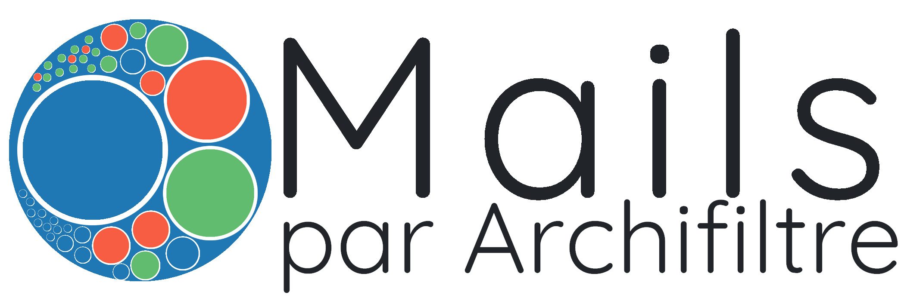

# Mails par Archifiltre
`dev`: [](https://codecov.io/gh/SocialGouv/archifiltre-mails)  
`main`: [](https://codecov.io/gh/SocialGouv/archifiltre-mails)


<p align="center">
    
</p>

## Initialisation
```sh
yarn install
```

**Ne pas oublier de copier le fichier `.env.dist` vers un `.env`.**

## Développement
### Installation des devtools (unix seulement)
```sh
yarn devtools
```

### Lancement
```sh
yarn dev
```

### Utiliser le debugger dans le main
```sh
yarn debug
```
Puis dans le "Run & Debug" de VSCode : "Attach to Electron"

## Tests
### Composants et intégration
```sh
yarn test

# ou pour les composants seulement
yarn test:components
# sinon
yarn test components

# ou pour l'integration seulement
yarn test:integration
# sinon
yarn test integration
```
Jest est utilisé en interne, donc les différents drapeaux de ligne de commande sont utilisable (comme `--watch` par exemple)

### E2E
Les tests E2E sont basé sur [Playwright](https://playwright.dev/). Il faut donc installer ses dépendances avant de pouvoir les lancer en local. Pour ça, déclarer la variable d'environnement `PLAYWRIGHT_SKIP_BROWSER_DOWNLOAD` à 1 puis lancer l'installation.
Shell :
```sh
PLAYWRIGHT_SKIP_BROWSER_DOWNLOAD=1 yarn playwright install-deps chromium
```
PowerShell :
```PowerShell
$env:PLAYWRIGHT_SKIP_BROWSER_DOWNLOAD=1; yarn playwright install-deps chromium
```
Batch :
```bat
set PLAYWRIGHT_SKIP_BROWSER_DOWNLOAD=1 & yarn playwright install-deps chromium
```

Lancer ensuite les tests avec la commande suivante :
```sh
yarn test:e2e
```

#### Cas Linux Headless / WSL2
Dans des cas de CI ou de noyau Linux "headless" (comme pour WSL2), il est important de lancer en amont un serveur graphique auquel les applications fenêtrées pour s'attacher.  
`XVFB` étant soit déjà présent sur la machine, soit dans tous les cas installé avec les dépendances de Playwright il suffit de le lancer soit en tâche de fond, soit dans une fenêtre annexe. (`xvfb-run` en exécution directe étant déconseillé)

```sh
# lancement dans un fenêtre
/usr/bin/Xvfb :0 -ac -screen 0 1280x1024x24

# ou pour lancer en tâche de fond ----------v
/usr/bin/Xvfb :0 -ac -screen 0 1280x1024x24 &
```

## License
Sous license [Apache-2.0](LICENSE)
