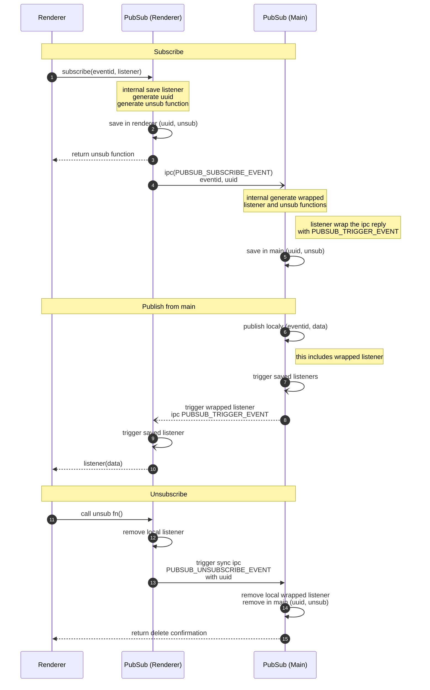

# PubSub

"Publier / Souscrire" est un service isomorphique global permettant à n'importe quoi de s'abonner à n'importe quel type d'évènement à n'importe quel endroit. Ce module permet simplement de s'abonner du `renderer` vers le `main`, du `renderer` vers le `renderer`, et du `main` vers le `main` .

Lorsque qu'un évènement `main` survient, il est donc diffusé à l'ensemble des souscripteurs en même temps quelque soit leur *process* ou leur nombre.

## Séquence

